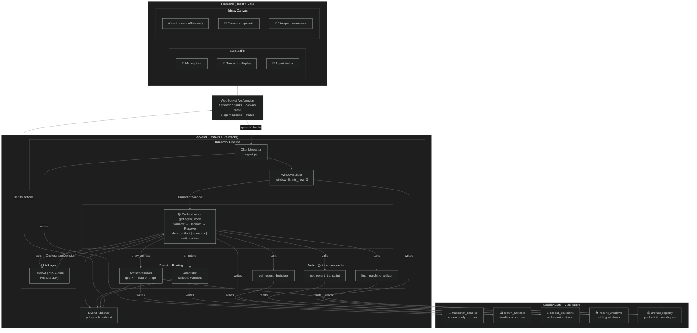

# TeachMe AI (ChalkAI)

> AI-powered lecture assistant that generates real-time visuals on a tldraw canvas as a teacher speaks.

## Architecture Overview



## How It Works

1. **Speech → Chunks** — The teacher speaks into the microphone. Speech-to-text produces transcript chunks sent to the backend via `POST /sessions/:id/chunks`.

2. **Chunks → Windows** — `ChunkIngestor` appends chunks to `SessionState`. `WindowBuilder` groups them into sliding windows (size 6, min 3 new chunks) and fires when ready.

3. **Window → Decision** — `OrchestrationService` sends the window text + canvas state to a Railtracks `agent_node`. The LLM returns a structured `OrchestratorDecision` with one of three intents:
   - **`draw_artifact`** — draw a new visual from the fixture library
   - **`annotate`** — add a label/callout to an existing visual
   - **`wait`** — do nothing (content is vague or logistical)

4. **Decision → Canvas Ops** — For `draw_artifact`, `ArtifactResolver` matches the query against the `ArtifactRegistry`, instantiates a JSON template into tldraw `create_shape` ops. For `annotate`, `Annotator` generates callout + arrow ops near the target artifact.

5. **Ops → Canvas** — `CanvasOpBatch` is published via `EventPublisher`. The frontend `EventAdapter` receives the ops and applies them to the tldraw editor.

## Key Design Decisions

| Decision | Rationale |
|----------|-----------|
| **Prebuilt artifact fixtures** | LLMs are unreliable at generating valid tldraw JSON. Fixtures guarantee visual quality. The model decides *what* to draw; the system owns *how*. |
| **Blackboard architecture** | `SessionState` is the single source of truth. Every component reads/writes to it, enabling stateful multi-step reasoning. |
| **Concept hierarchy** | `transformer_stack` subsumes `attention_matrix`. If the parent is already on canvas, the child is not drawn separately — preventing redundant visuals. |
| **Railtracks for orchestration** | Structured output schemas + tool calling without owning the app lifecycle. |
| **Sliding window** | Avoids per-chunk LLM calls. Batches transcript into coherent segments before reasoning. |

## Project Structure

```text
backend/
  app.py                    # FastAPI factory, wires all dependencies
  api/routes.py             # HTTP endpoints
  domain/
    models.py               # Pydantic models (TranscriptChunk, OrchestratorDecision, etc.)
    state.py                # SessionState (blackboard) + SessionStore
  orchestration/
    service.py              # OrchestrationService — runs the agent loop
    prompts.py              # System prompt + family hierarchy rules
    tools.py                # Railtracks function_node tools
  artifacts/
    registry.py             # Loads & indexes JSON fixture files
    resolver.py             # Maps decisions → CanvasOpBatch
    annotator.py            # Generates annotation callout ops
    fixtures/               # JSON templates (token_grid, attention_matrix, etc.)
  transcript/
    ingest.py               # ChunkIngestor
    windowing.py            # WindowBuilder (sliding window)
  streaming/
    publisher.py            # EventPublisher (pub/sub)
    subscribers.py          # Console + Recorder subscribers
  simulation/
    replay.py               # ReplayRunner for offline testing
  tests/
    test_integration.py     # 7 end-to-end integration tests
    test_traces/            # JSON execution traces from test runs

frontend/
  src/
    components/
      canvas/CanvasPane.tsx # tldraw canvas wrapper
      assistant/            # Thread panel, reasoning display
      layout/AppShell.tsx   # Main layout shell
    runtime/
      api-client.ts         # Backend HTTP client
      event-adapter.ts      # Translates backend events → canvas ops
      types.ts              # TypeScript type definitions
```

## Running

```bash
# Backend
.\.venv\Scripts\python.exe -m pip install -r backend/requirements.txt
# edit backend/.env and add OPENAI_API_KEY (or another supported provider key)
.\.venv\Scripts\python.exe -m uvicorn backend.app:app --reload --host 127.0.0.1 --port 8000

# Frontend
cd frontend
npm install
npm run dev -- --host=127.0.0.1 --port=5173

# Tests
.\.venv\Scripts\python.exe -m pytest backend/tests/test_integration.py -v --tb=short -s
```
