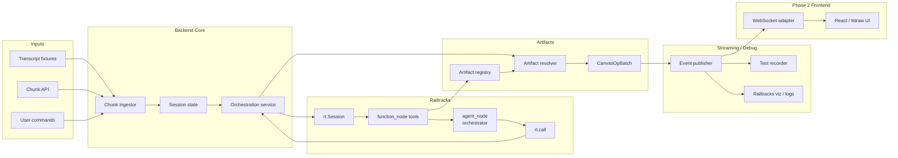

# TeachWithMeAI Agent Architecture v2

## 1. Decision Summary

This document replaces the earlier architecture with a design that is:

- consistent with published Railtracks usage patterns
- optimized for fast visual rendering
- artifact-first for known teaching visuals
- still capable of generating novel visuals when needed
- implementable in small phases without committing to a brittle agent stack

The core decision is:

- Use `Railtracks` for orchestration, tool calling, shared session context, observability, and optional specialist agents.
- Use `tldraw` as the canvas runtime and rendering engine.
- Do **not** make the frontend the primary agent brain.
- Do **not** rely on raw LLM-generated tldraw shape JSON as the default path.
- Do use a **component / artifact library** as the primary drawing path.

The frontend is interactive, but the backend remains the authoritative planner.

## 2. Product Goal

TeachWithMeAI listens to a live lecture, understands what concept is being explained, and keeps a whiteboard-style visual companion in sync. It should:

- react fast enough to feel live
- prefer polished reusable visuals over ad hoc generated diagrams
- support instructor-led pacing
- support direct user commands
- preserve visual continuity across a session
- degrade safely when the model is uncertain

This implies two distinct requirements:

1. Fast render path
2. Flexible design path

Those should not be handled by the same mechanism.

## 3. Architectural Position

### 3.1 Chosen architecture

Use a **backend-authoritative orchestrator with artifact-first rendering**.

High-level flow:

1. Frontend captures transcript chunks and user commands.
2. Backend updates lecture/session state.
3. Orchestrator decides what should happen next.
4. Backend prefers:
   - existing artifact/component
   - parameterized visual template
   - constrained layout generation
   - full LLM visual generation as last resort
5. Backend sends validated canvas mutation commands to frontend.
6. Frontend applies them through `tldraw` editor APIs.

### 3.2 What we are not doing

- We are not using the tldraw starter kit as the main agent loop.
- We are not sending the whole canvas to the model on every turn.
- We are not treating raw shape JSON generation as the normal drawing mode.
- We are not building a many-agent system first.

### 3.3 Why

The fastest and most reliable drawing path is:

- prebuilt visual component
- parameter fill
- deterministic placement
- immediate `editor.createShapes(...)`

That is also the only path likely to produce consistent quality across repeated concepts.

## 4. System Overview

```text
React / Next.js frontend
  - tldraw canvas
  - assistant panel
  - microphone / transcript UI
  - websocket client
  - local viewport + selection awareness

            |
            | WebSocket
            v

FastAPI backend
  - session manager
  - transcript ingestion
  - orchestrator workflow
  - artifact registry
  - layout engine
  - tldraw command validator
  - optional specialist agents

            |
            v

Railtracks runtime
  - agent_node / function_node tools
  - Session context
  - rt.call / optional call_batch
  - observability / visualizer
```

### 4.1 Architecture Diagram



## 5. Railtracks Usage Model

This architecture uses Railtracks in the way its notebook/docs demonstrate.

### 5.1 Railtracks responsibilities

- define tools with `@rt.function_node`
- define orchestrator and optional specialist agents with `rt.agent_node(...)`
- execute flows with `await rt.call(...)`
- hold shared session context in `rt.Session(context=...)`
- optionally read/write shared values with `rt.context.get/put/update`
- use Railtracks visualizer for debugging and replay

### 5.2 Railtracks does not own

- the live websocket loop itself
- raw browser/editor state
- the tldraw rendering pipeline

Those remain FastAPI + frontend concerns.

### 5.3 Practical pattern

Use FastAPI as the long-running session server. Inside each session:

- initialize a Railtracks `Session`
- store top-level lecture/session state in session context
- invoke the orchestrator agent on meaningful events
- keep the orchestration loop in Python application code

That means:

- Railtracks powers decisions
- FastAPI powers runtime coordination

## 6. Frontend Architecture

### 6.1 Core frontend responsibilities

- render tldraw canvas
- apply server-approved mutations
- capture mic/transcript input
- render agent status and actions
- provide local visual context back to backend on request

### 6.2 Frontend is not a dumb executor

The earlier design made the frontend too passive. It still needs local intelligence for:

- editor access
- selection context
- viewport bounds
- shape summaries
- screenshot capture if needed later
- optimistic UI handling for local-only interactions

But it should not be the system-of-record planner.

### 6.3 What to reuse from tldraw ideas

Even without adopting the starter kit agent loop wholesale, we should copy its principles:

- simplified visual context rather than raw full-canvas dumps
- action sanitization before application
- explicit model-visible shape formats
- bounded follow-up work / scheduling
- support for custom shapes

## 7. Canvas Model

We need three representations of the canvas.

### 7.1 Editor state

The actual `tldraw` store in the browser.

### 7.2 Server shadow state

A compact backend mirror used for orchestration decisions.

Suggested structure:

```python
{
    "page_id": "page:main",
    "camera": {"x": 0, "y": 0, "z": 1},
    "regions": {
        "intro": {"bounds": {"x": 0, "y": 0, "w": 1200, "h": 700}, "status": "idle"},
        "tokens": {"bounds": {"x": 1300, "y": 0, "w": 1200, "h": 700}, "status": "idle"},
        "embeddings": {"bounds": {"x": 0, "y": 800, "w": 1200, "h": 700}, "status": "idle"},
    },
    "shapes": {
        "shape:1": {
            "type": "concept_card",
            "region": "tokens",
            "bounds": {"x": 10, "y": 10, "w": 300, "h": 180},
            "artifact_id": "token_grid_v1",
            "semantic_role": "primary_visual"
        }
    },
    "clusters": [],
    "version": 12
}
```

### 7.3 Model-visible context

A compact view derived from shadow state:

- current region
- current viewport
- nearby semantic shapes
- occupancy / free space
- selected artifact families already used

This must be compact and cheap.

## 8. Session State

Use a single session object per active lecture/board.

Recommended state model:

```python
{
    "lecture": {
        "lecture_id": "transformers_101",
        "title": "Intro to Transformers",
        "mode": "live"
    },
    "transcript": {
        "chunks": [],
        "processed_cursor": 0
    },
    "notes": {
        "sections": [],
        "keyword_index": {}
    },
    "canvas": {
        "shadow_state": {},
        "pending_ops": [],
        "applied_ops": []
    },
    "artifacts": {
        "registry_version": "2026-03-28",
        "families_loaded": []
    },
    "orchestration": {
        "active_topic": None,
        "recent_decisions": [],
        "todos": [],
        "active_jobs": {}
    }
}
```

In Railtracks, initialize this in session `context` and expose focused helpers rather than letting every tool mutate arbitrary nested state.

## 9. Artifact-First Visual System

This is the most important part of the design.

### 9.1 Visual hierarchy

The system should render visuals through four tiers:

1. Exact artifact reuse
2. Parameterized component instance
3. Deterministic composition from visual primitives
4. LLM-generated novel layout

Most traffic should stay in tiers 1 and 2.

### 9.2 Artifact definition

Each artifact should be more than a raw shape dump.

Suggested schema:

```python
class ArtifactSpec(BaseModel):
    artifact_id: str
    version: str
    family: str
    title: str
    description: str
    tags: list[str]
    normalized_bounds: dict
    anchors: dict[str, dict]
    parameters: dict[str, dict]
    theme_slots: list[str]
    shape_template: list[dict]
    default_layout: dict
    allowed_transforms: list[str]
```

### 9.3 Required artifact capabilities

- parameter injection
- ID remapping on instantiation
- placement offsetting
- scaling inside region bounds
- optional text substitution
- theme substitution
- anchor points for arrows / connectors
- versioned migration

### 9.4 Example artifact families

- `token_grid`
- `embedding_space`
- `attention_matrix`
- `encoder_stack`
- `decoder_stack`
- `data_pipeline`
- `timeline`
- `comparison_table`
- `concept_card`
- `quiz_prompt_block`

### 9.5 Why this matters

Without parameterized artifacts, the system will keep regenerating mediocre diagrams that are slow, inconsistent, and hard to update.

## 10. Component Library

Artifacts are reusable visuals. Components are reusable semantic building blocks.

Recommended custom or semantic shapes:

- `ConceptCard`
- `LabeledArrow`
- `TokenChipRow`
- `MatrixGrid`
- `AxisPlot`
- `StackBlock`
- `CalloutNote`
- `SectionFrame`

If implemented as custom tldraw shapes, these can:

- reduce token load to the model
- improve editability
- make updates semantic rather than geometric

If custom shapes are too much for phase 1, emulate them with grouped default shapes but keep the semantic schema in backend state.

## 11. Orchestration Model

### 11.1 Single orchestrator first

Start with one primary orchestrator agent. Do not start with a worker swarm.

The orchestrator decides:

- what concept is active
- whether to draw, update, pan, annotate, or wait
- whether an artifact exists
- whether a specialist should be invoked

### 11.2 Specialist agents only where justified

Add specialist agents later for bounded tasks:

- lecture topic extraction
- artifact selection
- visual description generation
- fallback layout generation

### 11.3 Event-driven invocation

Do not keep a constantly looping LLM process alive.

Invoke orchestration on events:

- new transcript batch available
- user command received
- visual operation completed
- specialist request resolved
- system timeout / review checkpoint

### 11.4 Orchestrator output

The orchestrator should not emit raw shapes. It should emit a **plan**.

Suggested schema:

```python
class OrchestratorDecision(BaseModel):
    intent: Literal[
        "wait",
        "draw_artifact",
        "compose_visual",
        "annotate_existing",
        "move_camera",
        "ask_user",
        "review_canvas"
    ]
    topic: str | None
    target_region: str | None
    artifact_query: str | None
    rationale: str
    priority: Literal["low", "medium", "high"]
    constraints: dict = {}
```

This keeps the planner semantic and auditable.

## 12. Execution Pipeline

### 12.1 Pipeline stages

1. Ingest
2. Interpret
3. Plan
4. Resolve visual path
5. Validate command set
6. Apply to frontend
7. Confirm / reconcile

### 12.2 Step detail

#### Ingest

- append transcript chunks
- normalize user commands
- update recent lecture window

#### Interpret

- classify topic shift
- detect urgency
- detect whether current visual is stale, missing, or sufficient

#### Plan

Invoke Railtracks orchestrator agent with:

- recent transcript window
- active lecture notes section
- compact canvas summary
- recent decisions

#### Resolve visual path

Try in order:

1. `find_matching_artifact`
2. `instantiate_artifact`
3. `compose_from_components`
4. `fallback_generate_layout`

#### Validate command set

- ensure IDs are unique
- ensure positions are in-bounds
- ensure referenced shapes exist
- ensure action types are allowed
- ensure no unsafe document overwrite

#### Apply

- send operation packet over websocket
- apply with editor transaction if possible
- return result + created IDs

#### Confirm

- update shadow state
- log operation
- mark region status

## 13. Backend Tools

Recommended Railtracks tools:

- `search_notes(query) -> list[NoteSection]`
- `summarize_recent_transcript(window) -> TopicSummary`
- `find_matching_artifact(topic, style) -> ArtifactMatch | None`
- `instantiate_artifact(artifact_id, region, params) -> CanvasOpBatch`
- `compose_visual(spec) -> CanvasOpBatch`
- `annotate_shapes(shape_ids, note) -> CanvasOpBatch`
- `move_camera(region_or_bounds) -> CameraOp`
- `get_canvas_summary(region=None) -> CanvasSummary`
- `queue_review(reason) -> str`

Optional later tools:

- `generate_novel_layout(spec) -> VisualDraft`
- `compare_visual_options(spec) -> list[VisualOption]`
- `repair_failed_ops(op_batch) -> CanvasOpBatch`

## 14. Canvas Operation Protocol

Avoid sending arbitrary ad hoc messages. Use typed operation envelopes.

Suggested server-to-client schema:

```python
class CanvasOpEnvelope(BaseModel):
    op_id: str
    session_id: str
    op_type: Literal[
        "create_shapes",
        "update_shapes",
        "delete_shapes",
        "set_camera",
        "select_shapes",
        "show_status"
    ]
    source: Literal["system", "orchestrator", "artifact_engine", "user"]
    payload: dict
    shadow_version: int
```

Client-to-server:

```python
class CanvasOpResult(BaseModel):
    op_id: str
    success: bool
    created_ids: list[str] = []
    updated_ids: list[str] = []
    deleted_ids: list[str] = []
    error: str | None = None
```

This is much safer than free-form message types.

## 15. Visual Context Strategy

Do not send the full canvas to the model unless debugging.

### 15.1 Default context payload

Send:

- current transcript window summary
- current topic
- active region
- viewport bounds
- shape summaries in region
- occupancy metrics
- semantic elements already present

### 15.2 Debug / recovery mode

Allow richer context:

- detailed shape list for a region
- current screenshot
- recent operation history

### 15.3 Why

This keeps latency and token use down while preserving enough context to make good decisions.

## 16. Layout Strategy

### 16.1 Regions

Use region-based layout from day one. Each region has:

- bounds
- semantic purpose
- occupancy status
- artifact preference

### 16.2 Placement policy

For each visual request:

1. pick region
2. compute allowed bounds
3. fit artifact/component into bounds
4. reserve occupied space
5. connect to existing relevant elements

### 16.3 Deterministic layout engine

Implement a small deterministic layout utility before relying on the model for placement:

- stack
- grid
- row
- labeled pipeline
- matrix placement
- margin/padding fit

This should handle most educational visuals.

## 17. Fallback Novel Visual Generation

Novel generation should be constrained, not free-form.

### 17.1 Input

The fallback generator receives:

- target region bounds
- intended concept
- preferred visual style
- allowed primitive set
- max shape budget
- examples if available

### 17.2 Output

It returns an intermediate `VisualDraft`, not raw editor commands.

```python
class VisualDraft(BaseModel):
    title: str
    summary: str
    primitive_nodes: list[dict]
    connectors: list[dict]
    annotations: list[dict]
```

Then a deterministic compiler converts `VisualDraft` into tldraw operations.

This avoids direct shape hallucination.

## 18. tldraw Integration Details

### 18.1 Use the editor API directly

Frontend command handlers should wrap:

- `editor.createShapes`
- `editor.updateShapes`
- `editor.deleteShapes`
- `editor.setCamera`

### 18.2 Add a client-side sanitizer

Before applying:

- reject malformed payloads
- reject unknown op types
- reject impossible IDs
- reject operations against missing shapes unless explicitly allowed

### 18.3 Consider transactions

Apply each operation batch atomically where possible so partial renders do not leave the canvas inconsistent.

### 18.4 Shape conventions

- all created shapes get deterministic IDs
- all grouped artifact instances carry shared metadata
- all semantic shapes carry `meta` identifying `artifact_id`, `instance_id`, `role`

## 19. API Surface

### 19.1 WebSocket endpoint

`/ws/session/{session_id}`

Message families:

- transcript input
- user command input
- canvas operation envelope
- canvas operation result
- assistant status events
- diagnostics

### 19.2 REST endpoints

Recommended supporting endpoints:

- `POST /sessions`
- `GET /sessions/{id}`
- `POST /sessions/{id}/notes`
- `GET /artifacts`
- `POST /artifacts/validate`
- `GET /artifacts/{artifact_id}`
- `GET /health`

## 20. Persistence

Persist these separately:

### 20.1 Session persistence

- transcript chunks
- orchestrator decisions
- operation history
- lecture metadata

### 20.2 Artifact persistence

- registry specs
- shape templates
- preview images
- versions

### 20.3 Optional board snapshots

- periodic shadow state snapshot
- export of actual tldraw document

## 21. Observability

Use Railtracks visualizer plus app logging.

Track:

- transcript-to-render latency
- artifact hit rate
- novel-generation rate
- op validation failures
- canvas apply failures
- average shapes per op batch
- region occupancy
- topic-switch precision

High-value debugging logs:

- orchestrator input summary
- decision output
- selected visual path
- artifact parameters
- final operation batch

## 22. Failure Modes

### 22.1 Transcript ambiguity

Behavior:

- wait
- annotate lightly
- ask for clarification if user-facing

### 22.2 No matching artifact

Behavior:

- try component composition
- only then use fallback generation

### 22.3 Invalid shape batch

Behavior:

- reject
- log
- retry with narrower plan

### 22.4 Frontend/backend divergence

Behavior:

- request targeted reconciliation
- compare shadow version
- repair from last successful op batch

### 22.5 Too much on canvas

Behavior:

- move to next region
- collapse older visuals into summary cards
- preserve references rather than deleting blindly

## 23. Security and Safety

- never execute model-produced arbitrary code on the frontend
- never apply raw unsanitized model JSON
- bound shape count and payload size per operation batch
- enforce per-session quotas
- keep provider keys server-side only

## 24. Recommended Project Structure

```text
backend/
  api/
    ws.py
    routes.py
  orchestration/
    orchestrator.py
    decisions.py
    prompts.py
  railtracks_nodes/
    agents.py
    tools.py
    schemas.py
  canvas/
    ops.py
    validator.py
    layout.py
    shadow_state.py
  artifacts/
    registry.py
    models.py
    compiler.py
    families/
  lecture/
    transcript.py
    notes.py
    topic_detection.py

frontend/
  app/
  components/
    CanvasShell.tsx
    AssistantPanel.tsx
  canvas/
    opDispatcher.ts
    sanitizers.ts
    shapeMeta.ts
  websocket/
    client.ts
  transcript/
    mic.ts
    commands.ts
```

## 25. Implementation Plan

### Phase 1: Reliable skeleton

- FastAPI websocket session
- tldraw canvas integration
- session shadow state
- transcript ingestion
- single Railtracks orchestrator
- deterministic region layout
- artifact registry with 3 to 5 artifacts

Success metric:

- known topics render in under 500 ms after decision

### Phase 2: Better visuals

- parameterized artifacts
- semantic component library
- annotation updates
- camera behaviors
- operation validation + reconciliation

Success metric:

- repeated lecture topics produce stable visuals with minimal LLM drawing

### Phase 3: Flexible generation

- constrained visual draft generation
- fallback compiler
- richer topic detection
- review/checkpoint actions

Success metric:

- unseen topics still produce usable visuals without corrupting the board

### Phase 4: Polish

- snapshot/export
- artifact authoring workflow
- metrics dashboard
- multi-user / instructor controls

## 26. Minimal Viable Build

If time is tight, build only this:

- one websocket session
- one orchestrator agent
- one transcript parser
- three board regions
- five parameterized artifacts
- create/update/delete/camera ops
- shadow state
- logs + Railtracks viz

Do not build:

- worker swarm
- screenshot reasoning
- raw shape generation by default
- custom shapes in v1 unless clearly needed

## 27. Pseudocode Skeleton

```python
import railtracks as rt

@rt.function_node
def search_notes(query: str) -> str:
    ...

@rt.function_node
def find_matching_artifact(topic: str, style: str) -> dict | None:
    ...

@rt.function_node
def get_canvas_summary(region: str | None = None) -> dict:
    ...

DecisionAgent = rt.agent_node(
    name="Lecture Orchestrator",
    llm=ACTIVE_LLM,
    tool_nodes=[search_notes, find_matching_artifact, get_canvas_summary],
    output_schema=OrchestratorDecision,
    system_message="You decide what educational visual action should happen next."
)

async def handle_event(session_state, event):
    with rt.Session(context={"lecture_id": session_state.lecture_id}):
        decision = await rt.call(DecisionAgent, build_orchestrator_prompt(session_state, event))

    if decision.structured.intent == "draw_artifact":
        op_batch = instantiate_matching_artifact(...)
    elif decision.structured.intent == "compose_visual":
        op_batch = compose_visual(...)
    elif decision.structured.intent == "move_camera":
        op_batch = build_camera_op(...)
    else:
        return

    validated = validate_op_batch(op_batch, session_state.canvas.shadow_state)
    result = await send_to_frontend_and_wait(validated)
    reconcile_shadow_state(session_state, validated, result)
```

## 28. Final Recommendation

Build TeachWithMeAI as:

- a FastAPI session server
- a Railtracks-powered semantic orchestrator
- a tldraw-based rendering client
- an artifact/component-driven educational visual system

The key principle is:

**the model should decide intent; the system should own rendering quality**

That is the safest way to get both speed and good visuals.
